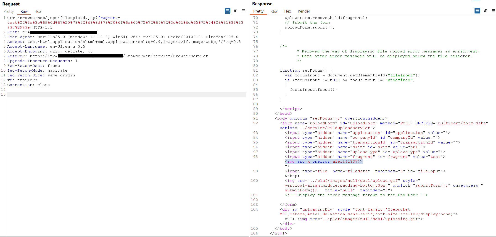
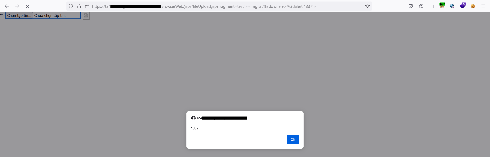

# Reflected-XSS-T24
In Temenos T24 R20.26, I found Reflected-XSS in BrowserWeb/jsps/fileUpload.jsp.<br>
Affected Version: T24-R20.26.<br>
Parameter Affected: fragment, skin
## Reproduce bug:
Send request to https://{url}/BrowserWeb/jsps/fileUpload.jsp with payload xss in 'fragment' parameter
Payload : ```">```

Payload trigger in browser:

